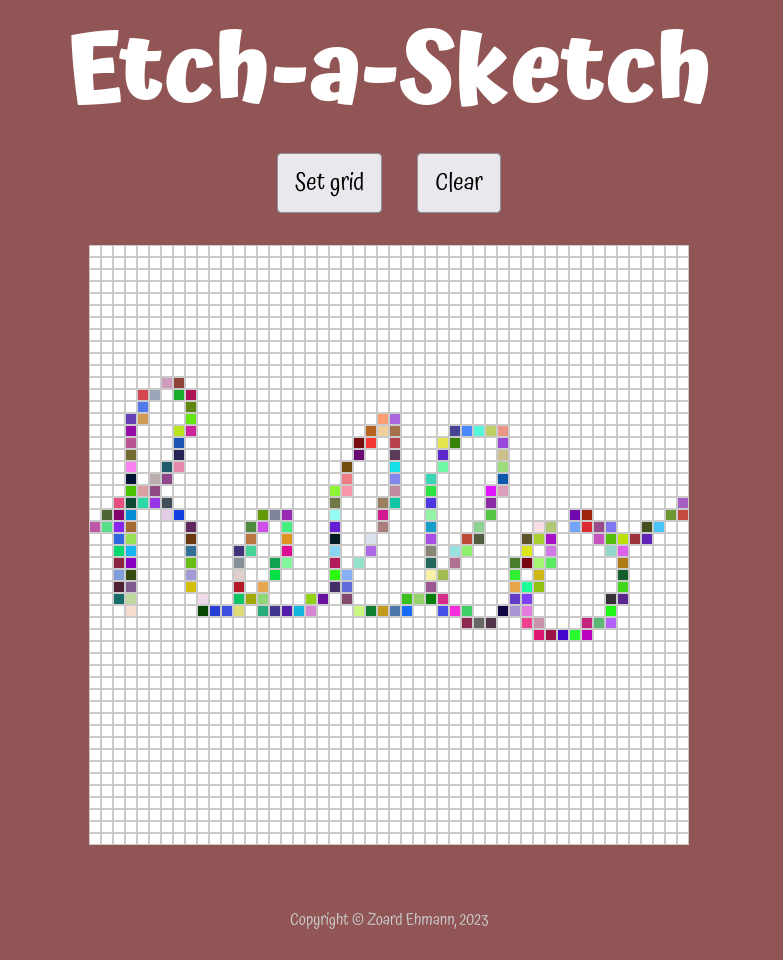

# Odin: Etch-a-Sketch

## Name

The Odin Project: Etch-a-Sketch

## Description

A browser version of something between a sketchpad and an Etch-A-Sketch.

Please check the [algorithm plan](./algorithm/algorithm.md) for a detailed description about the logic behind the solution.

## Visuals

## Usage

1. Copy the full path of the HTML to the browser to start the application
2. Click on _Set grid_ to specify grid size up to 100 squares per side
3. Click on _Clear_ to clear the board
4. Hover over squares with the mouse in order to color them
   - Each pass-through deepens the blackness by 10%

## Roadmap

1. Create a GUI version for desktop ✔
